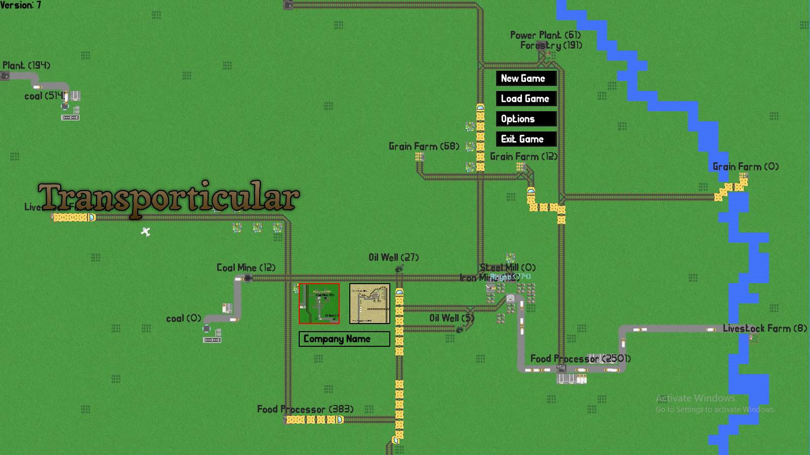

# Transporticular
### OpenTTD inspired transport tycoon game (2019)
YouTube Demo: 

Itch.io Page: https://renyreynoldson.itch.io/transporticular

In this simple 2D Transport Tycoon game, you must start your company from scratch to maximise profits, gain the respect of the locals and grow your company. Inspired by games such as Transport Tycoon Deluxe, this will put you in the hands of managing a transport company and building all of the connections and roads throughout the game. There are many aspects that must be balanced such as money, respect, produce and population; all while avoiding bankruptcy.

### How To Play
~~~
1. Select a map, enter text to name the company, then press start new game and open the finance menu to take out a loan. Everyday interest will be added on to the debt.

2. Start Building! Construct roads, tracks and airports. Then place bays and stations, select the start point to be the building producing products and the end building a refinery or a town.

3. Buses may be connected between 2 towns, the starting point is not important.

4. Try to pay off the loan as soon as possible, try to improve relationships and vote in the monthly proposal to prevent or approve laws.

5. Pressing the options menu in the top left will allow you to save the game and can be loaded again from the main menu.
~~~
### Controls
Use WASD to move screen and then use mouse pointer for all other menus.

### Info
DISCLAIMER: Displayed video is a tad outdated. This game was designed for a 1600x900 display yet mine is larger and fullscreen will work perfectly on most sized monitors. The main issue is low FPS at large company sizes yet this issue should be fixed within the coming weeks, along with bugs.

## Gallery

